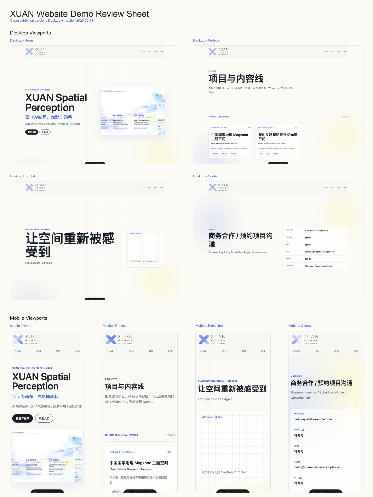
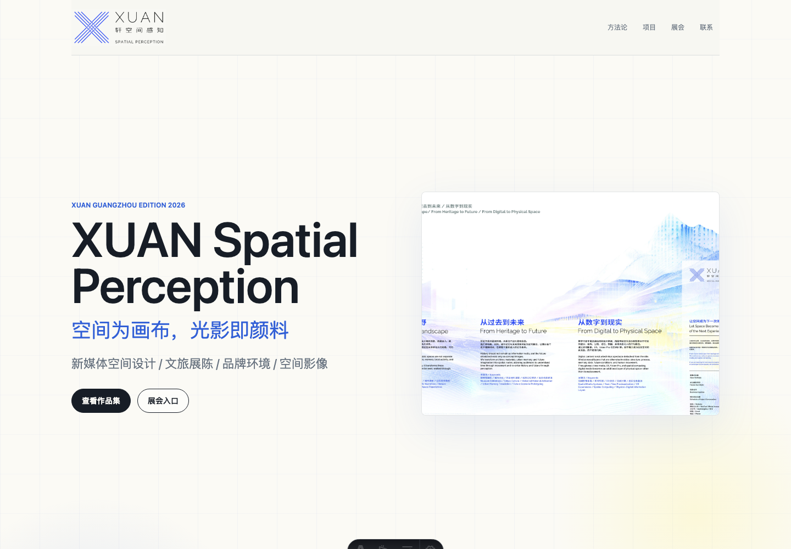
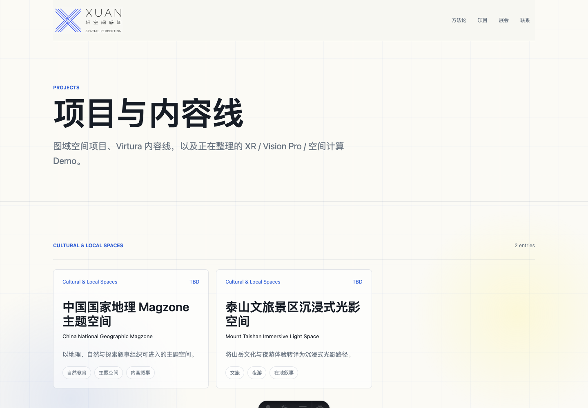
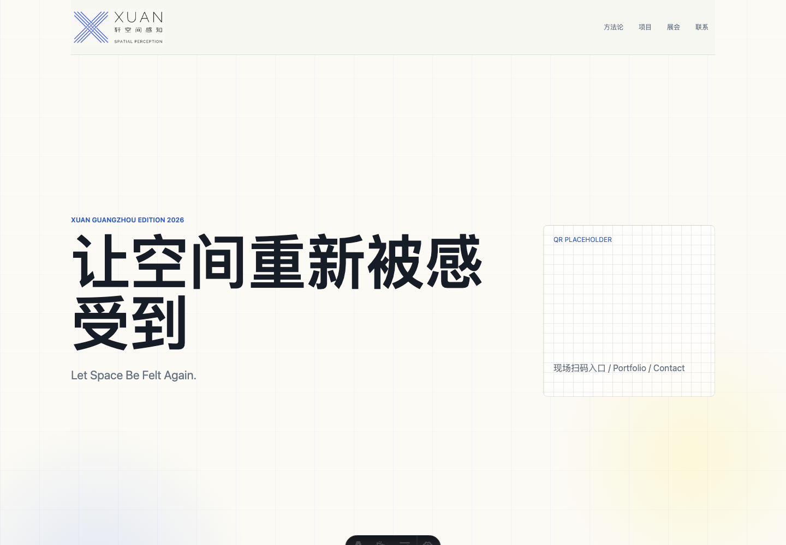
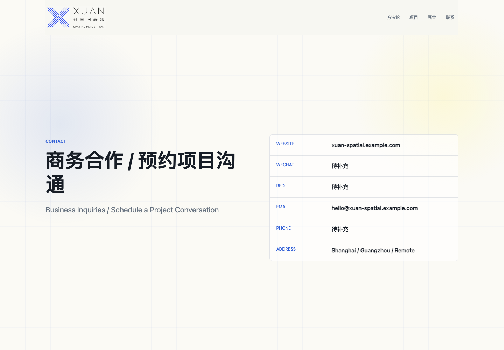
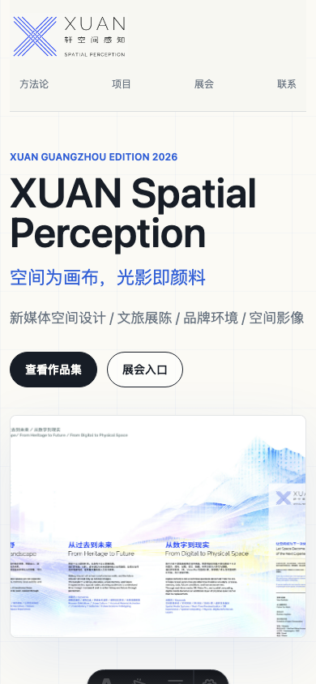
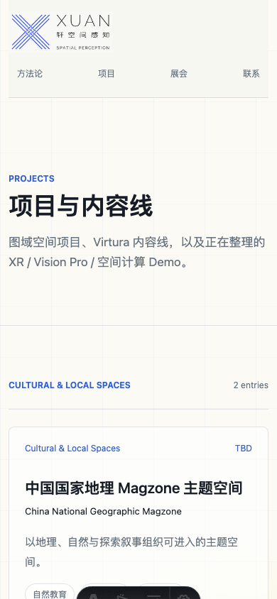
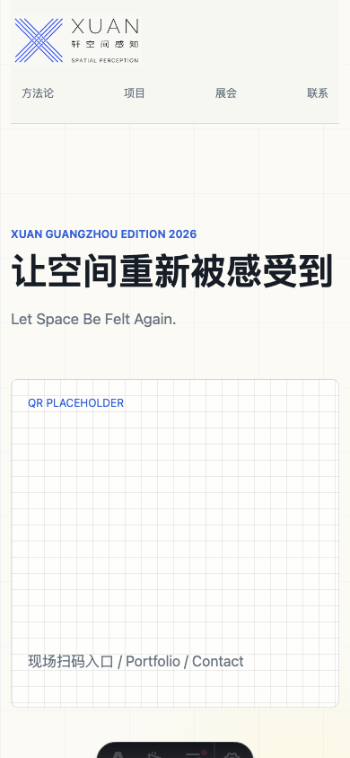
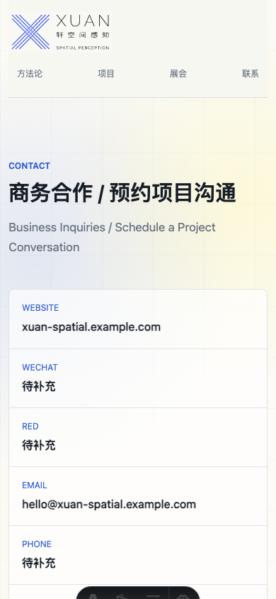

# XUAN Website Demo Review Report

Date: 2026-05-18  
Local demo: http://localhost:4321/

## Current State

This demo is an Astro static website for partner confirmation. It includes:

- Home page
- Projects index
- Project detail pages
- Methodology page
- Exhibition page
- Contact page
- Tencent Cloud deployment notes

The visual direction now references the provided exhibition wall artwork and has been tightened into a cleaner exhibition companion:

- Lighter white background
- Blue headline accents
- Pale yellow and blue spatial atmosphere
- Full temporary XUAN logo cropped from the wall draft
- Smaller text scale and looser Chinese line-height
- Shorter homepage/project/contact copy
- Less conceptual explanation, more direct exhibition navigation

## Reference Order

- `展墙图文1.jpg`: upper / wide wall layout reference
- `展墙图文2.jpg`: lower / pillar panel layout reference

## Screenshot Overview

## Individual Screens

### Desktop

### Mobile

## Notes For Boss Review

- Logo is temporary and cropped from the current exhibition draft. It should be replaced with the final source asset later.
- Contact info, QR codes, public/private project visibility, and final project media still need confirmation.
- The current site builds successfully to `dist/` and is ready for CloudBase Hosting or COS static hosting once Tencent Cloud login/resources are confirmed.
